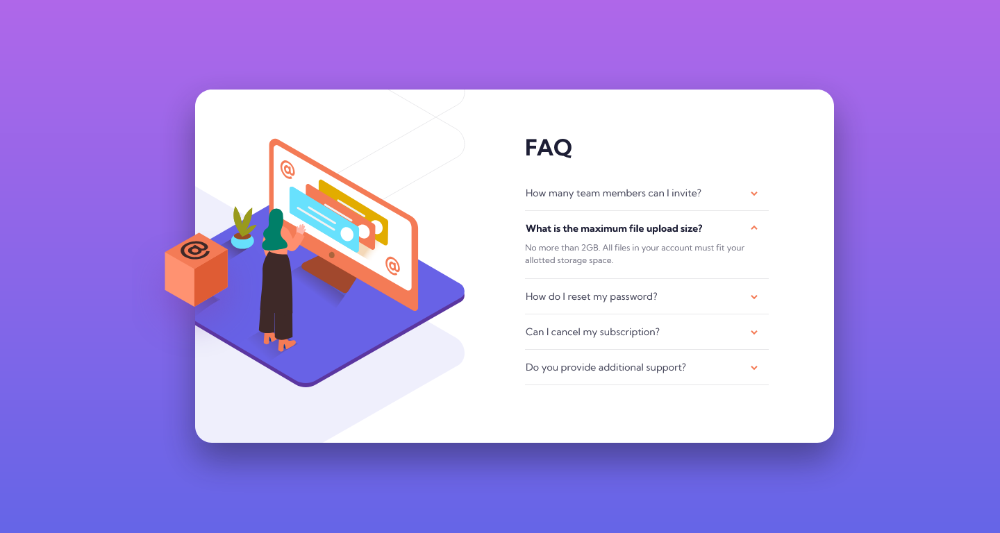

# Frontend Mentor - FAQ accordion card solution

This is a solution to the [FAQ accordion card challenge on Frontend Mentor](https://www.frontendmentor.io/challenges/faq-accordion-card-XlyjD0Oam). Frontend Mentor challenges help you improve your coding skills by building realistic projects. 

## Table of contents

- [Overview](#overview)
  - [The challenge](#the-challenge)
  - [Screenshot](#screenshot)
  - [Links](#links)
- [My process](#my-process)
  - [Built with](#built-with)
  - [What I learned](#what-i-learned)
  - [Continued development](#continued-development)
  - [Useful resources](#useful-resources)
- [Author](#author)

## Overview

### The challenge

Users should be able to:

- View the optimal layout for the component depending on their device's screen size
- See hover states for all interactive elements on the page
- Hide/Show the answer to a question when the question is clicked

### Screenshot

### Links

- Solution URL: [GitHub Repo](https://github.com/CardboardPL/Frontend-Mentor-FAQ-Accordion-Card)
- Live Site URL: [GitHub Pages](https://cardboardpl.github.io/Frontend-Mentor-FAQ-Accordion-Card/)

## My process

### Built with

- Semantic HTML5 markup
- CSS custom properties
- Flexbox
- Mobile-first workflow
- JavaScript

### What I learned

While doing this project I learned on how to use JavaScript to ensure a smooth transition for accordions as the value of auto isn't transitionable. Some properties I learned are:
- scrollHeight - This helped me to calculate the height necessary to fit the answer element without any overflows.
- offsetHeight - This helped me to reflow the content so that after setting the height to auto I can also transition to the close state.

### Continued development

I plan to use this as an inspiration for future projects.

### Useful resources

- [MDN article about the scrollHeight property](https://developer.mozilla.org/en-US/docs/Web/API/Element/scrollHeight) - This helped me to calculate the height of the faq answers to allow smooth transitions.
- [MDN article about the offsetHeight property](https://developer.mozilla.org/en-US/docs/Web/API/HTMLElement/offsetHeight) - This helped me understand a new property and a way to forcibly reflow the content.

## Author

- Frontend Mentor - [@CardboardPL](https://www.frontendmentor.io/profile/CardboardPL)
- Twitter - [@SirPLWasTaken](https://www.twitter.com/SirPLWasTaken)